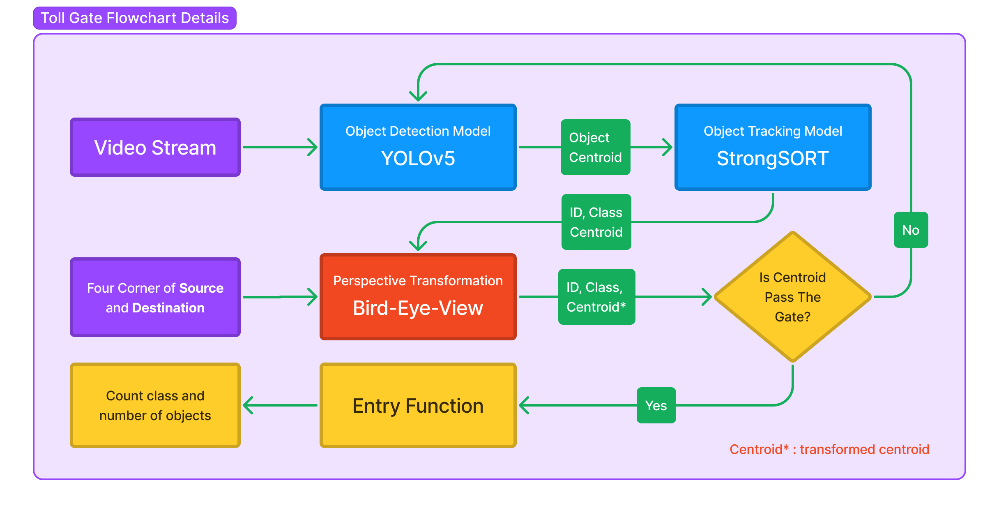

<div align="center">

# Toll Gate Vehicle Counting

<a href="https://www.python.org/"></a>
<a href="https://pytorch.org/get-started/locally/"></a>
<a href="https://github.com/mikel-brostrom/Yolov5_StrongSORT_OSNet"></a><br>

</div>

## 📼&nbsp;&nbsp;Demo
<div align="center">


</div>

## 📌&nbsp;&nbsp;Introduction

Toll Gate Vehicle Counting is a system that aims to count the number of vehicles entering toll gates using computer vision technology. The author has blogged about this project which can be seen on [ruhyadi.github.io](https://ruhyadi.github.io/project/computer-vision/toll-gate-vehicle-counting) and [ruhyadi.medium.io](https://ruhyadi.medium.com/toll-gate-vehicle-counting-5e0a396c7a9f).

The flow diagram of this system can be seen in the image below.

<div align="center">



</div>

## 🍿&nbsp;&nbsp;Inference
```bash
python track.py \
    --source ./data/toll_gate.mp4 \
    --yolo-weights ./weights/yolov5s.pt \
    --strong-sort-weights ./weights/osnet_x0_25_msmt17.pt \
    --classes 2 5 7 \
    --save-vid
```

## ❤️ Acknowledgement

The project is part of **Nodeflux Intership x Kampus Merdeka**

- [YOLOv5 by Ultralytics](https://github.com/ultralytics/yolov5)
- [mikel-brostrom/Yolov5_StrongSORT_OSNet](https://github.com/mikel-brostrom/Yolov5_StrongSORT_OSNet)